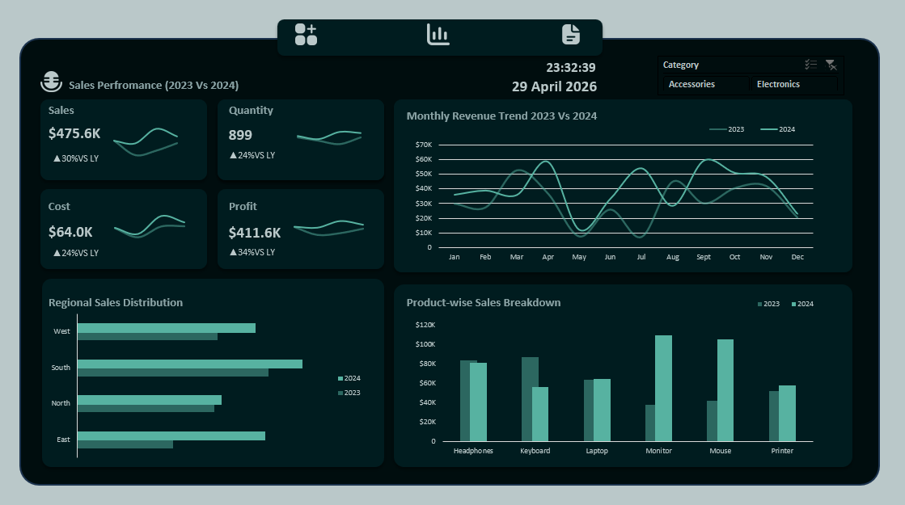

# Corporate Sales Performance Optimization Analysis (Excel)

##  Business Overview
This analytics project transforms raw, chaotic transactional data into an enterprise-level business intelligence asset. The primary objective is to eliminate manual data parsing for stakeholders by delivering a dynamic, fully automated interactive dashboard. This solution tracks key performance indicators (KPIs), isolates regional performance gaps, and exposes product category trends to drive executive-level revenue strategy.

---



## Tech Stack & Analytics Toolkit
* **Advanced Data Processing:** Power Query (ETL pipeline architecture, data type normalization).
* **Analytical Engines:** Dynamic Pivot Tables, multi-tiered sorting, and advanced aggregation matrices.
* **Visualization Suite:** Interactive slicers, continuous timeline trackers, and custom executive-level summary cards.

---

## Core Business Questions Addressed

1. **Revenue Distributions:** Which specific product segments drive over 70% of total revenue margins?
2. **Temporal Trends:** Are there specific operational quarters or months showing systematic conversion drops?
3. **Regional Disparities:** Which territories are underperforming relative to seasonal sales baselines?

---

## Technical Architecture & Workflow

### 1. Data Extraction, Transformation, and Loading (ETL)
* Utilized **Power Query** to ingest operational logs.
* Converted unformatted text strings into proper temporal data types.

### 3. Executive Dashboard Implementation
* Constructed an interactive, customer-facing tracking interface.
* Implemented cross-filtering capability via multi-slicer modules (Product Category) allowing stakeholders to switch views instantaneously without altering raw source data.

---

## Key Business Insights Delivered
* **Operational Anomalies:** Discovered a recurring performance drop in May, allowing the inventory team to preemptively scale back shipping costs.

---

## How to Interact with this Project
1. Clone this repository using your terminal:
   ```bash
   git clone https://https://github.com/iganabrian/Sales-Performance-Analysis-using-Excel
   ```
2. Open the `.xlsx` file using Microsoft Excel 2019 or later.
3. Access the **Dashboard** tab and toggle the interactive slicers on the left panel to filter the transactional data models in real-time.


